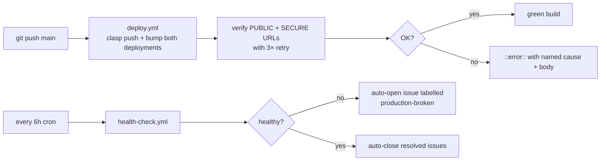

# Deployment registry

The Issue Addressal Portal ships as **one** standalone Apps Script project
with **two** web-app deployments. Google's UI is the only source of truth
for the deployment URLs and their per-deployment settings — this file
mirrors that state so operators don't have to open the editor to know
which URL is which.

Keep this file in sync with **Deploy → Manage deployments** in the
canonical Apps Script project. See [`requirement.md`](../requirement.md)
§19.8 for the design rationale and [`README.md`](../README.md#deploy) for
the cutting/updating runbook.

## Canonical project

- **Project name**: Issue Addressal Portal (IRP)
- **Project type**: Standalone (NOT container-bound to a Google Sheet).
  If the Apps Script editor was opened via a Sheet's Extensions menu,
  that is a different project id — do not push code there.
- **Standalone `scriptId`**: `REPLACE_WITH_STANDALONE_PROJECT_ID`
  (also in `.clasp.example.json`; copy to `.clasp.json` locally).

## Deployments

| Deployment | Execute as | Who has access | Live `.../exec` URL | Verify with |
|---|---|---|---|---|
| **Public**  | `USER_DEPLOYING`  | `ANYONE_ANONYMOUS`             | `https://script.google.com/macros/s/AKfycbwyrWVDKsSiXpTvBMlEj470MeH80DHGTGD44aYf0chVegZeEqEoZWmN_QSUAEHSG2Ib/exec` (rev 2026-07-12 — cut inside TA_IRP_Launch to consolidate onto the CI-target project) | Open `<url>?diag=deployment` in incognito — expect `mode: "USER_DEPLOYING"`, empty `activeEmail`, non-empty `effectiveEmail`. |
| **Secure**  | `USER_ACCESSING`  | `ANYONE` (any Google account)  | `https://script.google.com/macros/s/AKfycbzWfDC5iq2RXoL5qtt4rQHwOrdj4nWGKNzytdByH67Lkk4QNetfYdrM3nXuuUj8rEQm/exec` (identified via anonymous curl 2026-07-11 → HTML title `"Issue Addressal Portal - Access Required"`) | Open `<url>?diag=deployment` — Google renders an HTML sign-in gate (HTTP 200, `text/html`, title contains `"Access Required"`). After sign-in, expect JSON with `mode: "USER_ACCESSING"`, `activeEmail == effectiveEmail == <you>`. |

> **Superseded URL (2026-07-12):** the previous PUBLIC URL
> `AKfycbzfqTrf8fR…` lived in a different Apps Script project
> (`TA_Issue_Manager`, scriptId `1GHVaWaf…`) that CI was never wired to.
> It kept serving May-10 code (`v24`, response `{"success":true,"message":"TA Issue Management API is running",…}`) while CI bumped versions inside `TA_IRP_Launch` (`1dcYix1t…`). Fix was to cut a fresh public deployment inside `TA_IRP_Launch` — now the canonical.

> **Anonymous fingerprint** (confirmed against production 2026-07-11 via
> `curl -sSL "<url>?diag=deployment"`):
> - Public → `HTTP 200`, `application/json`
> - Secure → `HTTP 200`, `text/html`, `<title>…Access Required</title>`
>   (Google does **not** issue a 302 to `accounts.google.com` — it serves
>   the sign-in gate inline as HTML. Any tooling that watches for a
>   redirect header will falsely conclude the deployment is broken.)

After both URLs are known, populate the CONFIG sheet:

| CONFIG key            | Value                              | Consumer |
|-----------------------|------------------------------------|----------|
| `PUBLIC_WEBAPP_URL`   | Public `.../exec` URL              | `API.signOut()` (redirects secure users back to public landing) |
| `TECH_WEBAPP_URL`     | Secure `.../exec` URL              | `signIn()` on the public landing page (redirects to secure for Google login) |

Then run `clearConfigCache()` from the Apps Script editor so the next
request re-reads the sheet.

## GitHub Actions automation

`.github/workflows/deploy.yml` runs `clasp push` and bumps both
deployments to a new version on every push to `main` under `src/**`,
`appsscript.json`, or `.claspignore`. It also runs on
`workflow_dispatch` with a `deploy_new_version` toggle.

Repository configuration required (Settings → Secrets and variables → Actions):

| Kind     | Name                    | Purpose |
|----------|-------------------------|---------|
| Secret   | `CLASPRC_JSON`          | Contents of `~/.clasprc.json` from a `clasp login` on the deployer's machine. Raw JSON or base64 accepted (base64 recommended — immune to paste corruption). |
| Secret   | `CLASP_JSON`            | Contents of `.clasp.json` (points at the canonical `scriptId`). Raw JSON or base64. |
| Secret   | `DEPLOYMENT_ID`         | Public deployment ID (from Deploy → Manage deployments → "…" menu → Deployment ID). When set, the workflow updates this deployment in place; when empty, a *new* deployment is created every run (produces a fresh `/exec` URL — usually not what you want). |
| Secret   | `DEPLOYMENT_ID_SECURE`  | Secure deployment ID. Same rule as above. When empty, the secure-deploy step is skipped. |
| Variable | `WEBAPP_URL_PUBLIC`     | Public `.../exec` URL (the row in the Deployments table above). When set, the workflow verifies `?diag=deployment` returns HTTP 200 with `mode: USER_DEPLOYING` after each deploy. |
| Variable | `WEBAPP_URL_SECURE`     | Secure `.../exec` URL. When set, the workflow verifies the URL bounces anonymous requests to `accounts.google.com` (proving the sign-in gate is active). |

**Verification step behavior.** When the URL variables are absent, the
verify steps are skipped silently — deploy still succeeds. To turn on
end-to-end automation, fill in both `WEBAPP_URL_*` variables once, after
the first manual cut.

**Not automated by CI:** OAuth re-consent after adding a scope
(`syncRoleAccessNow` needs a real editor session), populating the
CONFIG sheet's `PUBLIC_WEBAPP_URL` / `TECH_WEBAPP_URL` (both are
one-time values), and running `checkOAuthScopes` (would require
enabling the Apps Script API and adding an `executionApi` block to the
manifest, which we deliberately do not do — it exposes an additional
attack surface). Trigger these from the editor as noted in the setup
runbook.

## Maximum-automation setup (long-run)

Three workflows together reduce human intervention to a handful of
one-time clicks:

| Workflow | Trigger | Purpose |
|---|---|---|
| `bootstrap.yml` | `workflow_dispatch` (manual, one-shot) | Creates the standalone Apps Script project (optional) and cuts both PUBLIC + SECURE deployments via `clasp create-deployment`. Prints all IDs / URLs into the run's step summary. If `GH_ADMIN_PAT` secret is set (fine-grained PAT with `secrets:write` + `variables:write`), it writes them straight back to repo secrets — zero copy-paste. Otherwise the operator pastes them once. |
| `deploy.yml` | push to `main` under `src/**` / `appsscript.json` / `.claspignore` | Pushes code, bumps both deployment versions, verifies both live URLs with 3-attempt exponential backoff. Named-cause error hints on every failure path. |
| `health-check.yml` | cron `17 */6 * * *` + `workflow_dispatch` | Probes both live URLs every 6 hours. Opens (or comments on) a GitHub issue labelled `production-broken` when a probe fails. Auto-closes the issue on recovery. |

### Full first-time bootstrap (from a completely empty repo)

1. Generate `CLASPRC_JSON` in [Google Cloud Shell](https://shell.cloud.google.com) — no local install needed:
   ```bash
   npm install -g @google/clasp
   clasp login --no-localhost      # click the URL, paste the auth code back
   base64 -w 0 ~/.clasprc.json     # copy the output
   ```
   Paste as repo secret `CLASPRC_JSON`.
2. **Actions → Bootstrap → Run workflow** with:
   - `create_project = true` (or skip if you have an existing `scriptId`)
   - `create_public  = true`
   - `create_secure  = true`
3. Read the step summary — it lists exactly which values to paste as which secrets/variables. (Skipped automatically if `GH_ADMIN_PAT` is set.)
4. In the Apps Script editor, run `setupConfigSheet` once and approve the Google OAuth consent dialog.
5. Fill the CONFIG sheet's `PUBLIC_WEBAPP_URL` + `TECH_WEBAPP_URL` from step 3 and run `clearConfigCache`.

From here on, every `git push origin main` under `src/**` triggers `deploy.yml` end-to-end. `health-check.yml` catches any silent drift between pushes.

### Ongoing minimum-intervention loop



### Long-run migration to zero re-consent

The one remaining Google-mandated human step is **OAuth re-consent when scopes change** (or when the deployer's refresh token is revoked). Two paths to eliminate that step entirely — both are significant refactors, listed here for future reference:

| Approach | What changes | Cost | Benefit |
|---|---|---|---|
| **Workload Identity Federation (WIF)** — GitHub OIDC → Google service account | Replace `clasp push` with direct Apps Script REST API calls authenticated via `google-github-actions/auth@v2`. Service account owns the Apps Script project (or the project has the SA as an editor). | ~200-300 lines of custom Node.js to marshal file trees into `projects.updateContent` payload. Loss of `clasp pull`/`clasp status` convenience. | Zero long-lived credentials in GitHub. Zero re-consent ever. Zero browser click ever. New deployer onboarding is `gh` CLI only. |
| **Apps Script API + service account key** | Same as WIF but with a long-lived JSON service-account key stored as a GitHub secret. | ~200-300 lines, plus periodic key rotation policy. | Same as WIF minus the "zero long-lived credential" property. |

Both approaches are considerable refactors for the sake of avoiding a browser click that only happens every 1–2 years (Google refresh tokens don't expire on their own). Recommendation: **stay on clasp + user OAuth** until either (a) a deployer handover forces token regeneration frequently, or (b) a scope change is planned that will trigger re-consent for many people.

## Orphan / drift projects

Any Apps Script project other than the canonical one above is drift.
Symptoms include:

- Two different `scriptId`s appearing in `.clasp.json` on different
  developer machines.
- A container-bound script (opened via a Sheet's Extensions menu) that
  shows up in Apps Script's project picker alongside the standalone one.
- Deployment URLs that don't match this registry.

Remediation:

1. Verify (via `?diag=deployment`) which live URLs are actually in use
   by users and match them to the canonical project.
2. In each drift project: **Deploy → Manage deployments → Archive** any
   active deployment (Google keeps the URL reachable for a short grace
   period, but new requests will 404 after archive propagates).
3. Rename the drift project to `⚠️ NOT USED — see <canonical scriptId>`
   so nobody re-opens it by accident.
4. Update every developer's local `.clasp.json` to point at the
   canonical `scriptId` (copy from `.clasp.example.json`).

## Change log

| Date | Change |
|------|--------|
| 2026-07-11 | Registry created. |
| 2026-07-11 | Documented required GitHub Actions secrets/variables; noted the `WEBAPP_URL_*` verify hooks added to `deploy.yml`. |
| 2026-07-11 | Identified live URLs via anonymous `curl … ?diag=deployment`: `AKfycbzfqTrf8fR…` = PUBLIC (returns JSON), `AKfycbzWfDC5iq2R…` = SECURE (returns HTML sign-in gate). Corrected the CI verify step which had wrongly assumed Google issues a 302 to `accounts.google.com` for secure deployments — Google actually serves an inline HTML gate. |
| 2026-07-11 | Shipped `bootstrap.yml` (one-shot project + deployment cutter with optional `GH_ADMIN_PAT` auto-writeback of secrets) and `health-check.yml` (6-hourly probe + auto-open/close `production-broken` issue). Added 3-attempt retry with 15s backoff to the deploy-time verify steps. Documented the long-run WIF migration path. |
